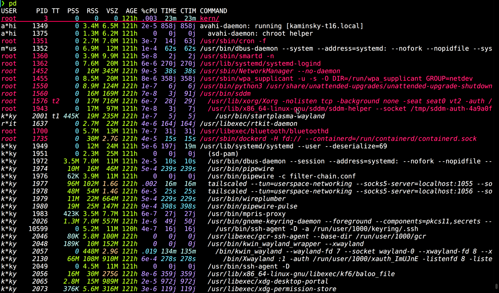
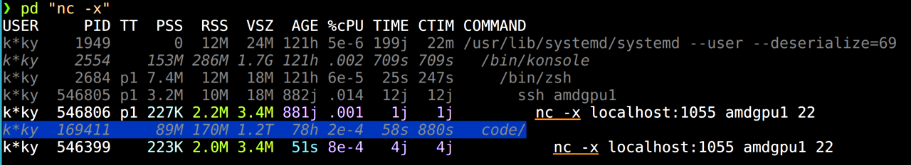
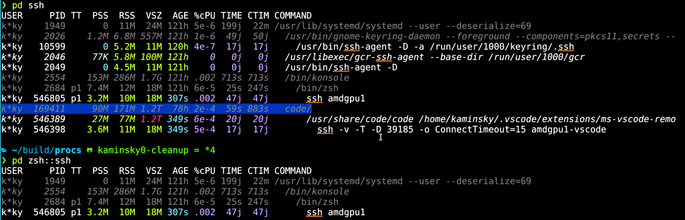
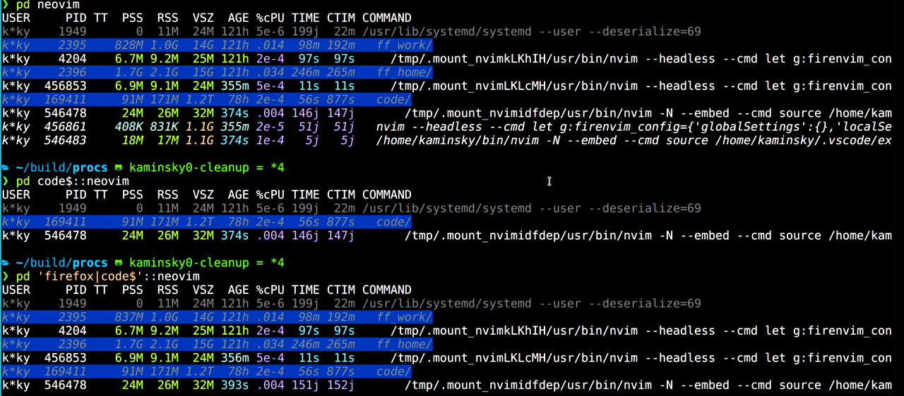

# Michael's procs configuration

## Setup

There are several pieces:

1. Copy the *procs* configuration files from `configs/kaminsky0` to
   `~/.config/procs`.  These are based on Chuck's `cb0` config, but with
   some modifications.

2. Configure Zsh to load the `pd()` function in `pd.zsh`.  This function
   references the `pd-labels.awk` script, so you might need to modify
   the path (see top of function).

## Overview

This configuration uses a couple of features that are available in
the most recent release of *procs*: process labels and the parent path
action in *pf*.

The high-level idea is to pre-process the input to *pd*, i.e., the
output of `pf -ifap`.  Each line of the output represents a PID that
matches the given pattern, followed by the parent PIDs up to the root
of the process tree.

The `pd()` function annotates that output in two ways.

- First, it adds an "explicit" label to the first PID on each line.
  Those are processes that matched the pattern explicitly, as opposed to
  the other PPIDs on each line which might or might not have a match.

- Second, it adds a handful of application-specific labels that help
  *pd* do roll-ups/merges for these more complex applications that spawn
  various children processes.  Using regular expression matches doesn't
  always work; for example, when more than one app spawns the same
  subprocess with the same arguments.  It should be relatively easy to
  add additional applications to the shell function.

*pd* takes these labeled PIDs and makes the labels available to the
"kind" engine; it can also output the labels in a new LABELS (%l) column.

Finally, the `pd()` shell function post-processes the output.  It uses the
LABELS column to find PIDs that are not labeled "explicit" and removes the
ANSI colors.  That, in combination with the full parent process path (from
`pf -ifap`) allows us to show the matching processes in color, but also
see their provenance in a subtle way.

## Examples

- **Regular *pd***.  Without any arguments, the output should look very
  similar to what you get with the `cb0` configuration and `-s user`.  The
  roll-ups/merge behavior (not shown in this first screenshot) is slightly different for certain applications (see above).

  

- **Search for a pattern**.  Note that matching text is underlined,
  and non-matching parents/ancestors are not-colored/dark.

  

- **Search for a pattern that exists in multiple roll-ups.** Note that
  only non-"explicit" process are rolled-up, which shows you what you're
  looking for without cluttering the output.

  

- **Wide output**.  Notice that the first root process without an
  explicit match is not colored, but the second one does have its color
  since "plasma" appears in the command.  Also note that even though
  "plasma" appears *only* in the wide output, the truncated output is
  still colored since that PID has the "explicit" label (`pf -f` looks
  at the entire command).

  

- **Scoping**.  Sometimes you want to match a pattern but only within a
  specific process sub-tree.  The `pd()` function accepts an additional
  syntax, `scope::process`.  For example, you can search for instances
  of "ssh" that were launched in a shell versus another application.

  
  
  You can also uses a regular expression in the *scope*.

  

### Notes

- Labels should not be a suffix of another label, e.g., using `code:`
  and `vscode:` will likely give you unintended results from the "kind"
  engine.

- There maybe be corner cases that don't work.
